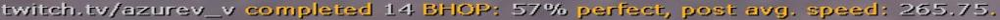
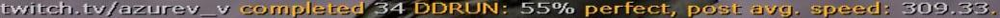
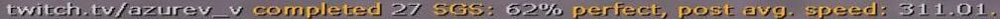

# movestats
Плагин выводит в чат статистику хороших сессий: BHOP, DDRUN, SGS.

## Требование
| Название | Версия |
| :- | :- |
| [ReHLDS](https://github.com/rehlds/rehlds) |  |
| [ReGameDLL_CS](https://github.com/rehlds/ReGameDLL_CS/releases) |  |
| [Metamod-R](https://github.com/rehlds/Metamod-R/releases) |  |
| [AMXModX (v1.9 or v1.10)](https://www.amxmodx.org/downloads-new.php) |  |
| [ReAPI](https://github.com/rehlds/reapi) |  |

## Описание

### Сессии
- BHOP (Процент перфекта, средняя скорость)

- DDRUN (Процент перфекта, средняя скорость)

- SGS (Процент перфекта, средняя скорость)

### Аретакты
- С места (Не выводит артефакт в чат)
- Slide (Выводит в чат, если во время или до сессии игрок использовал surf)
- Drop (Выводит в чат, если во время или до сессии игрок падал или совершал движение вниз)

### В будущем
- Добавить артефакты: slip, ladder, water
- Добавить сессии: FallRun, DuckBhop
- Добавить меню, добавить возможность выводить все свои сессии.

## Спасибо

### Тестировщики
[hedqi](https://github.com/hedqi)

[azurev_v](https://www.twitch.tv/azurev_v)
